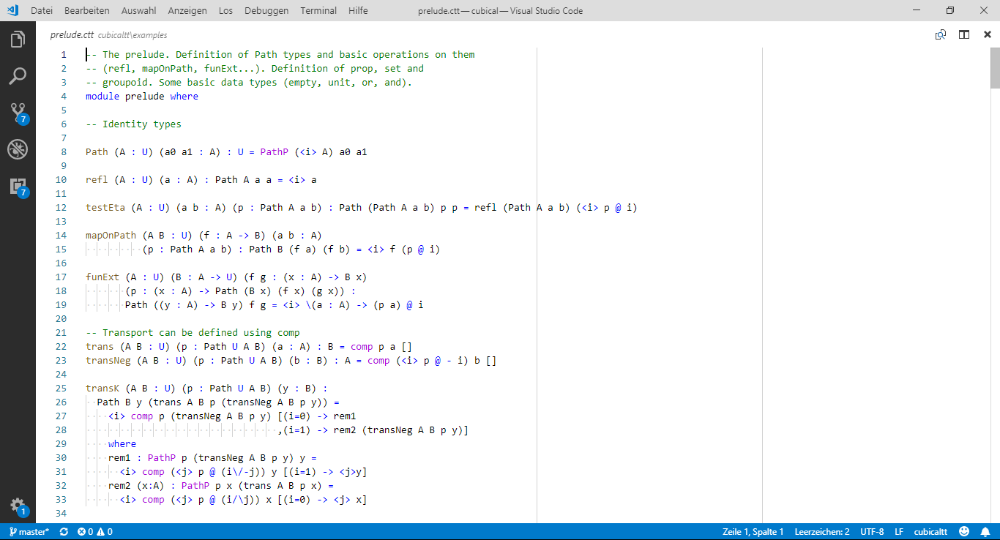

[cubicaltt](https://github.com/mortberg/cubicaltt) (or [yacctt](https://github.com/mortberg/yacctt/blob/master/yacctt.el)) syntax highlighting for Visual Studio Code.

Based on the original plugin for [Vim](https://github.com/mortberg/cubicaltt/blob/master/cubicaltt.vim) and [GNU Emacs](https://github.com/mortberg/cubicaltt/blob/master/cubicaltt.el).



# Installation

```
$ cd ~/.vscode/extensions
$ git clone https://github.com/forked-from-1kasper/cubicaltt-vscode
```

# VSIX?
Too hard.
